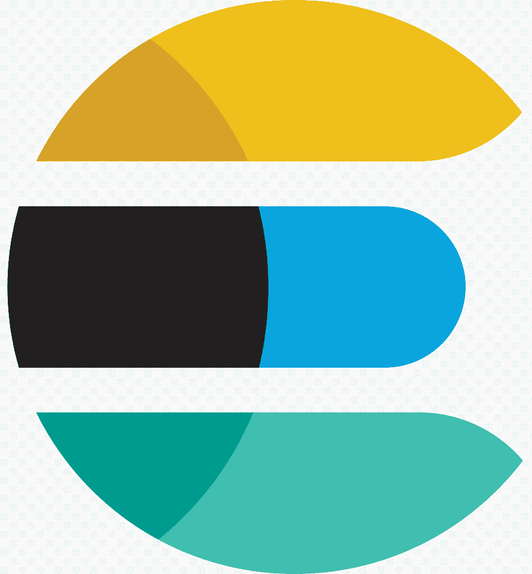
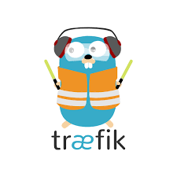

## Hi 👋, Welcome to Sudo's world!

[](https://badges.pufler.dev)
[](https://www.linkedin.com/in/junghongkim/)
[](https://www.instagram.com/sudopaeg/)
[](https://github.com/sudopaeg)
</br>

```rust
use std::sync::{Arc, Mutex};
use std::thread;
pub struct SimpleHuman {
  fullname: &str,
  nickname: &str,
  from: Countries,
  languages: mut Vec<&str>,
  skillz: mut Vec<&str>,
  architectures: mut Vec<&str>
  currently_in: mut String,
}
// impls hidden :P
let jung = Arc::new(Mutex::new(SimpleHuman {
  fullname: "Jung Hong Kim",
  nickname: "sudo",
  from: Countries::SouthKorea,
  languages: vec!(["Korean", "English", "Mandarin", "TypeScript", "Rust", "Python", "Go", "C#"]),
  skillz: vec!(["React", "Recoil", "Node", "Kubernetes", "Docker", "AWS", "ElasticSearch", "Terraform", "Git", "Jira", "Xamarin"]),
  architectures: vec!(["microservices", "distributed inference", "design thinking", "event-driven"]),
  currently_in: String::from("Hong Kong 🇭🇰"),
}));
thread::spawn(move || awesome_life::random_update(Arc::clone(&jung)));
```

## Jung::beautify_aboutme()

- 🖥 I'm a full-stack developer, cloud architect and DevOps specialist
- 💼 Currently the founding member and CTO of [Dayta AI](https://dayta.ai)
- 🎓 Studied Bachelor of Computer Science and Bachelor of Business Administration at Hong Kong University of Science and Technology
- 🤖 Interest areas include Artificial Intelligence, Cloud Computing, Sustainable and Affordable Technology for Innovation!

## Jung::beautify_skillz()

### Frontend

<p>
  
  
  
  
</p>

### Backend

<p>
  
  
  
</p>

### DevOps

<p>
  
  
  
  
  
  
</p>

### Cloud & Networking

<p>
  
  
  
</p>

## Jung::fetch_stats()


<!--START_SECTION:activity-->
<!--END_SECTION:activity-->
